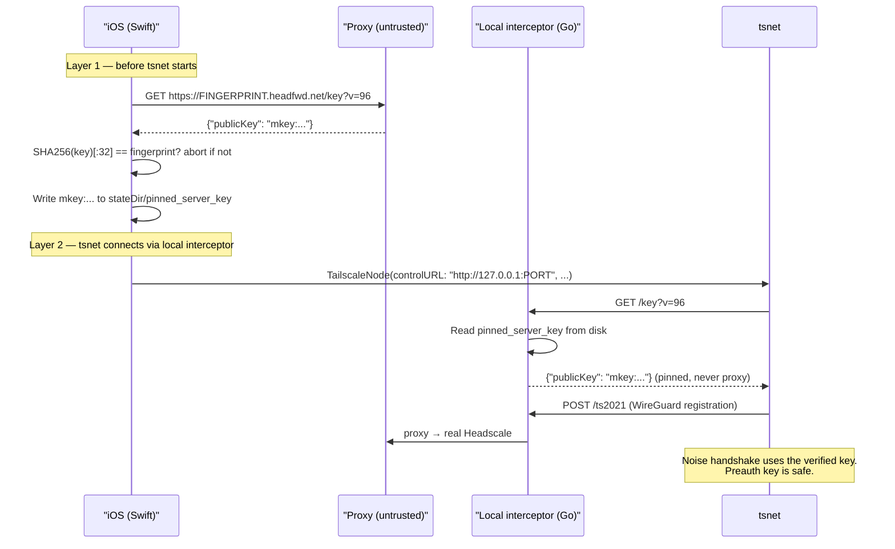

# iOS Key Verification & Pinning Plan

## The Problem

Today the iOS app trusts the QR code payload blindly:
- `server = "https://a1b2c3d4e5f60718293a4b5c6d7e8f90.headfwd.net"` is stored and used as the tsnet control URL
- No check is performed to ensure the fingerprint subdomain actually corresponds to the Headscale Noise key behind it
- tsnet independently fetches `/key?v=96` from the proxy on every app launch with no fingerprint verification and no pinning

## Threat Model: Proxy Is Untrusted

Per `NEVER-TRUST-PROXY.md`: the proxy is treated as a potentially rogue or compromised relay.

**The preauth key theft attack (without this fix):**

```
1. tsnet fetches /key?v=96 from proxy
2. Rogue proxy returns attacker's own Noise public key instead of legitimate key
3. tsnet uses attacker's key → Noise handshake succeeds with attacker's server
4. Attacker decrypts the Noise channel → extracts preauth key in plaintext
   (auth key has no cryptographic binding to the device keypair — confirmed)
5. Attacker registers their own device on the legitimate Headscale using the stolen key
6. Legitimate user's connect attempt fails ("preauth key already used")
```

A rogue proxy can always pass a naive pre-check (it knows the legitimate key from registration) and then serve a different key to tsnet's independent fetch.

## Defence: Two Layers

### Layer 1 — iOS verifies the key against the QR fingerprint

Before tsnet starts, iOS independently fetches `/key?v=96` and runs:

```
fingerprint_from_url = parse subdomain from config.server
key_from_server      = GET https://FINGERPRINT.headfwd.net/key?v=96 → "mkey:..."
computed_fingerprint = SHA256(key_from_server)[:32]
assert computed_fingerprint == fingerprint_from_url
```

SHA256 preimage resistance means the proxy cannot serve a different key that passes this check. If it returns the legitimate key, we have it. If it returns any other key, the check fails and we abort before tsnet ever starts.

The verified key is written to `<stateDir>/pinned_server_key`.

### Layer 2 — libtailscale reads the pinned key from disk instead of fetching

A small patch to libtailscale's Go wrapper starts a local HTTP interceptor before calling `srv.Up()`. This interceptor:
- For `GET /key` requests → reads `pinned_server_key` from the state directory and returns it
- For all other requests → proxies to the real `ControlURL` (the actual Headscale instance)

`tsnet.Server.ControlURL` is set to the local interceptor address. tsnet never makes a `/key` request to the proxy. The key tsnet uses for the Noise handshake is **always the key Swift verified**.

**Combined guarantee:** The proxy can manipulate neither layer simultaneously — failing Layer 1 aborts before tsnet starts; failing Layer 2 is impossible because tsnet never asks the proxy.

## Architecture



## Changes

### 1. iOS — New file: [`ios/HeadFwdApp/Services/ServerKeyVerifier.swift`](ios/HeadFwdApp/Services/ServerKeyVerifier.swift)

- Parse fingerprint from `config.server` URL (subdomain before first `.`)
- Fetch `GET /key?v=96` using `URLSession.shared` (standard HTTPS, before tsnet starts)
- Compute `SHA256(Data(publicKey.utf8))` via `CryptoKit`, take first 16 bytes as lowercase hex
- Compare → throw `ServerKeyVerifier.Error.fingerprintMismatch` on failure
- Write `mkey:...` string to `<stateDir>/pinned_server_key`
- On subsequent connects: re-fetch, re-verify, compare with pinned value → throw on mismatch

### 2. iOS — [`ios/HeadFwdApp/Services/RealTailscaleService.swift`](ios/HeadFwdApp/Services/RealTailscaleService.swift)

In `connect(config:)`, after creating the state directory and before creating `TailscaleNode`:

```swift
// Verify key against QR fingerprint and pin to disk before tsnet starts.
// libtailscale will serve this pinned key for /key requests via its local interceptor,
// preventing the rogue-proxy preauth-key theft attack.
try await ServerKeyVerifier.verify(config: config, stateDir: tsDir)
```

Error propagates and sets `connectionState = .error(...)` — same pattern as the existing timeout guard.

### 3. libtailscale patch — New file: [`ios/patches/libtailscale-pinned-key.patch`](ios/patches/libtailscale-pinned-key.patch)

A `git format-patch`-style diff against the libtailscale Go wrapper. In the function that creates and starts the `tsnet.Server`:

```go
// If a pinned server key file exists in the state dir, start a local HTTP
// interceptor that serves the pinned key for /key requests and proxies
// everything else to the real control URL. This prevents tsnet from fetching
// the key from the (untrusted) proxy.
if pinnedKey, err := readPinnedServerKey(cfg.Dir); err == nil {
    localURL, cleanup, err := startKeyInterceptor(cfg.ControlURL, pinnedKey)
    if err == nil {
        defer cleanup()
        cfg.ControlURL = localURL
    }
}
```

`startKeyInterceptor` (~25 lines): binds a random loopback port, starts `http.Server` with a `ServeMux` that handles `/key` (returns pinned key as JSON) and `/` (reverse-proxies to the real ControlURL using `httputil.NewSingleHostReverseProxy`).

`readPinnedServerKey` (~5 lines): reads `<dir>/pinned_server_key`, trims whitespace, validates `mkey:` prefix.

### 4. Makefile — [`ios/Makefile`](ios/Makefile)

Add a patch step to the vendor target so the patch is automatically applied after every fresh clone:

```makefile
$(LIBTAILSCALE_DIR)/.git:
    git clone --depth=1 https://github.com/tailscale/libtailscale.git $(LIBTAILSCALE_DIR)
    cd $(LIBTAILSCALE_DIR) && git apply $(CURDIR)/patches/libtailscale-pinned-key.patch
```

The `.patch` file is tracked in the repo, reviewable as a diff, and applied automatically. If an upstream libtailscale change ever breaks the patch, the build fails loudly at `make vendor`.

## Documentation

### New file: [`docs/ios-key-verification.md`](docs/ios-key-verification.md)

Covers:
- The proxy-distrust threat model and why it applies here
- The full preauth key theft attack chain (without this fix)
- How the two-layer defence closes it
- SHA256 preimage resistance as the foundation of Layer 1
- Why the local interceptor (Layer 2) eliminates tsnet's independent proxy fetch
- TOFU pinning lifecycle (first use, re-use, state reset)
- The patch maintenance strategy (patch file + Makefile auto-apply)
- Residual considerations (e.g. the loopback interceptor itself as a surface)

### Update [`README.md`](README.md)

Add a **Security** section referencing:
- `docs/REGISTRATION.md` (sidecar↔proxy challenge-response)
- `docs/ios-key-verification.md` (iOS key pinning + preauth key protection)

## File Summary

- New: `ios/HeadFwdApp/Services/ServerKeyVerifier.swift`
- Modified: `ios/HeadFwdApp/Services/RealTailscaleService.swift`
- New: `ios/patches/libtailscale-pinned-key.patch`
- Modified: `ios/Makefile`
- New: `docs/ios-key-verification.md`
- Modified: `README.md`
