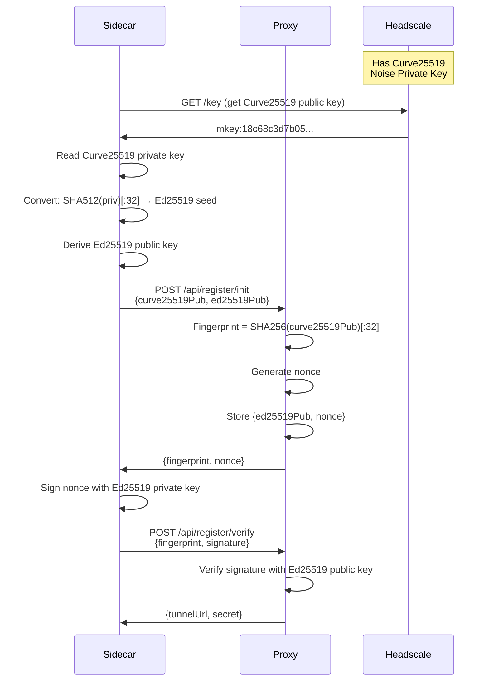

# Curve25519 → Ed25519 Conversion Implementation

**Status:** Work in Progress (Mid-Implementation)  
**Branch:** `feature/curve25519-ed25519-conversion`  
**Last Updated:** 2026-02-01

## Overview

This document describes the ongoing implementation of cryptographic key conversion to enable challenge-response authentication using Headscale's existing Noise protocol keys.

## The Problem

Headscale uses **Curve25519** keys for the Noise protocol (ECDH key exchange), but our challenge-response authentication system requires **Ed25519** keys (digital signatures). These are mathematically related but serve different cryptographic purposes:

- **Curve25519 (Montgomery curve)**: Used for Diffie-Hellman key exchange (ECDH)
- **Ed25519 (Edwards curve)**: Used for digital signatures (ECDSA)

### Key Challenge

You cannot directly use a Curve25519 key to create Ed25519 signatures. The proxy receives Headscale's Curve25519 **public** key, but there's no straightforward way to convert a Curve25519 public key to an Ed25519 public key without access to the private key.

## The Solution

### Approach: SHA-512 Conversion + Dual Key Transmission

1. **Sidecar Side:**
   - Read Headscale's Curve25519 private key (from `noise_private.key`)
   - Convert it to Ed25519 using SHA-512 hash: `ed25519_seed = SHA512(curve25519_private)[:32]`
   - Derive Ed25519 keypair from the seed
   - During registration, send BOTH:
     - Curve25519 public key (for fingerprint computation)
     - Ed25519 public key (for signature verification)

2. **Proxy Side:**
   - Compute fingerprint from Curve25519 public key (for routing)
   - Store Ed25519 public key for signature verification
   - Verify signatures using Ed25519 public key directly

### Architecture



## Implementation Details

### 1. Sidecar Changes (`headfwd-sidecar/main.go`)

#### Key Parsing

Headscale stores Noise keys in text format:
```
privkey:c05cf8ccb9d4f8d9c996f430be18e12d71ef984470e081cf0415e2044d27f853
```

Parse this format:
```go
keyStr := string(keyData)
keyHex := keyStr[8:] // Remove "privkey:" prefix
// Trim trailing whitespace
curve25519Key, _ := hex.DecodeString(keyHex)
```

#### Conversion Function

```go
func getEd25519PublicKey(keyPath string) ([]byte, error) {
    // Read Curve25519 private key (32 bytes)
    curve25519Key := readAndParseKey(keyPath)
    
    // Convert: SHA-512 hash, use first 32 bytes as Ed25519 seed
    hash := sha512.Sum512(curve25519Key)
    ed25519Seed := hash[:32]
    
    // Derive Ed25519 keypair
    ed25519PrivateKey := ed25519.NewKeyFromSeed(ed25519Seed)
    ed25519PublicKey := ed25519PrivateKey.Public().(ed25519.PublicKey)
    
    return ed25519PublicKey, nil
}
```

#### Registration Request

```go
type RegistrationInitRequest struct {
    PublicKey        string `json:"publicKey"`        // Curve25519 for fingerprint
    Ed25519PublicKey string `json:"ed25519PublicKey"` // Ed25519 for verification
}

initReq := RegistrationInitRequest{
    PublicKey: keyData.PublicKey, // "mkey:18c68c..."
    Ed25519PublicKey: hex.EncodeToString(ed25519PublicKey), // "60bf9e7d6d0d..."
}
```

### 2. Proxy Changes (`headfwd-proxy/src/index.ts`)

#### Added Dependency

```json
{
  "dependencies": {
    "@noble/curves": "^2.0.1"
  }
}
```

Import:
```typescript
import { ed25519 } from '@noble/curves/ed25519.js';
```

#### Registration Init Handler

```typescript
async function handleRegisterInit(request: Request, env: Env): Promise<Response> {
    const { publicKey, ed25519PublicKey } = await request.json();
    
    // Compute fingerprint from Curve25519 key (for routing)
    const fingerprint = await computeFingerprint(publicKey);
    
    // Generate challenge
    const nonce = generateNonce();
    
    // Store Ed25519 key for verification (not Curve25519)
    localChallenges.set(fingerprint, { 
        publicKey: ed25519PublicKey || publicKey,
        nonce, 
        expiresAt: Date.now() + 300000 
    });
    
    return Response.json({ fingerprint, nonce, expiresAt });
}
```

#### Signature Verification

```typescript
async function verifyNoiseSignature(
    publicKeyStr: string, 
    nonce: string, 
    signatureHex: string
): Promise<boolean> {
    // Expect Ed25519 public key in hex format (no prefix)
    const ed25519PublicKey = hexToBytes(publicKeyStr);
    const nonceBytes = new TextEncoder().encode(nonce);
    const signatureBytes = hexToBytes(signatureHex);
    
    // Verify using @noble/curves
    return ed25519.verify(signatureBytes, nonceBytes, ed25519PublicKey);
}
```

## Current Status

### ✅ Completed

1. **Proxy:**
   - ✅ Installed `@noble/curves` library
   - ✅ Updated registration init to accept both keys
   - ✅ Modified signature verification to use Ed25519 directly
   - ✅ Store Ed25519 public key in challenge data

2. **Sidecar:**
   - ✅ Implemented Curve25519→Ed25519 conversion using SHA-512
   - ✅ Created `getEd25519PublicKey()` helper function
   - ✅ Updated registration request to send both keys
   - ✅ Parse Headscale's `privkey:hex` format correctly

3. **Documentation:**
   - ✅ Created comprehensive registration docs
   - ✅ Updated README with security details
   - ✅ Added architecture diagrams

### 🔄 In Progress / Not Tested

1. **End-to-End Testing:**
   - ⏳ Full registration flow with converted keys
   - ⏳ Signature verification between sidecar and proxy
   - ⏳ Verify Ed25519 public keys match on both sides

2. **Known Issues:**
   - ⚠️ Last test showed "Invalid signature" error
   - ⚠️ Need to verify the Ed25519 public key is being transmitted correctly
   - ⚠️ Need to debug hex encoding/decoding of keys

## How to Test

### 1. Start the Stack

```bash
# Terminal 1: Start Headscale
cd /Users/joycelin/repos/headfwd
docker compose up

# Terminal 2: Start Proxy
cd headfwd-proxy
npm run dev

# Terminal 3: Test Registration
cd headfwd-sidecar
go build -o headfwd-sidecar .
./headfwd-sidecar --register \
  --headscale http://localhost:8080 \
  --proxy http://localhost:8787 \
  --noise-key /Users/joycelin/repos/headfwd/headscale/data/noise_private.key
```

### 2. Debug Output

Look for these log messages:

**Sidecar:**
```
Headscale Curve25519 public key: mkey:18c68c3d7b05...
Ed25519 public key for signing: 60bf9e7d6d0d...
Challenge received: fingerprint=b4ff5ae7bbf053c9bd58d16df68702e0
```

**Proxy (in wrangler dev output):**
```
POST /api/register/init 200 OK
POST /api/register/verify 200 OK  (success)
POST /api/register/verify 403 Forbidden  (failure)
```

### 3. Manual Testing

```bash
# Get Headscale's Curve25519 public key
curl -s http://localhost:8080/key?v=96 | jq -r .publicKey
# Output: mkey:18c68c3d7b0575b3cfee2670c6365fb044e93dc6d8a91c8390b5041ba2116d47

# Test key conversion (Go)
cd headfwd-sidecar
cat > test_keys.go << 'EOF'
package main
import (
    "crypto/ed25519"
    "crypto/sha512"
    "encoding/hex"
    "fmt"
)
func main() {
    // Curve25519 private key from Headscale
    curve25519Hex := "c05cf8ccb9d4f8d9c996f430be18e12d71ef984470e081cf0415e2044d27f853"
    curve25519Key, _ := hex.DecodeString(curve25519Hex)
    
    // Convert to Ed25519
    hash := sha512.Sum512(curve25519Key)
    ed25519PrivateKey := ed25519.NewKeyFromSeed(hash[:32])
    ed25519PublicKey := ed25519PrivateKey.Public().(ed25519.PublicKey)
    
    fmt.Printf("Ed25519 public key: %x\n", ed25519PublicKey)
}
EOF
go run test_keys.go
rm test_keys.go
```

## Debugging Guide

### Issue: "Invalid signature" error

**Possible causes:**

1. **Key mismatch**: Ed25519 public key sent to proxy doesn't match the private key used for signing
   - **Debug**: Log both keys in sidecar and compare
   - **Fix**: Ensure `getEd25519PublicKey()` and `signWithNoiseKey()` use same conversion

2. **Hex encoding issues**: Key bytes corrupted during hex encoding/decoding
   - **Debug**: Log hex strings at each step
   - **Fix**: Verify no extra characters (newlines, spaces)

3. **Nonce encoding**: Nonce bytes don't match between signing and verification
   - **Debug**: Log nonce in both sidecar and proxy
   - **Fix**: Ensure consistent UTF-8 encoding

4. **Wrong key being verified**: Proxy using Curve25519 key instead of Ed25519 key
   - **Debug**: Check proxy's `localChallenges.get(fingerprint).publicKey`
   - **Fix**: Ensure Ed25519 key is stored, not Curve25519

### Debug Commands

```bash
# Check Noise key format
cat /Users/joycelin/repos/headfwd/headscale/data/noise_private.key | hexdump -C

# Test signature verification manually
cd headfwd-sidecar
go run -tags debug main.go --register ...  # Add debug logging

# Check proxy logs
# Look in Terminal 2 (wrangler dev) for signature verification errors
```

## Next Steps

### Immediate (To Complete This Branch)

1. **Fix signature verification:**
   - Add debug logging to both sidecar and proxy
   - Verify Ed25519 keys match on both sides
   - Test full registration flow

2. **Add error handling:**
   - Better error messages when keys don't match
   - Validation of Ed25519 key format
   - Fallback to legacy registration if needed

3. **Testing:**
   - End-to-end registration test
   - Verify tunnel establishment after registration
   - Test with fresh Headscale instance

### Future Enhancements

1. **Simplification:**
   - Consider if we can avoid dual-key approach
   - Investigate using Curve25519 for both fingerprint and verification

2. **Documentation:**
   - Add security analysis of SHA-512 conversion
   - Document key lifecycle and rotation
   - Add troubleshooting guide

3. **Production Readiness:**
   - Add metrics for registration success/failure
   - Implement key caching
   - Add rate limiting

## Files Modified

```
headfwd-proxy/
├── package.json          # Added @noble/curves
├── package-lock.json     # Locked dependencies
└── src/
    ├── index.ts          # Registration + verification logic
    └── types.ts          # Type definitions

headfwd-sidecar/
├── main.go               # Key conversion + registration
├── go.mod                # Dependencies (user removed filippo.io/edwards25519)
└── go.sum                # Dependency checksums

docs/
├── REGISTRATION.md                      # Architecture overview
├── REGISTRATION-STATUS.md               # Implementation status
├── IMPLEMENTATION-COMPLETE.md           # Completion summary
└── CURVE25519-ED25519-IMPLEMENTATION.md # This file

README.md                 # Updated with security details
docker-compose.yml        # Updated for key access
headscale/config/config.yaml  # Fixed configuration
```

## References

- [RFC 8032: Edwards-Curve Digital Signature Algorithm (EdDSA)](https://tools.ietf.org/html/rfc8032)
- [RFC 7748: Elliptic Curves for Security](https://tools.ietf.org/html/rfc7748)
- [@noble/curves Documentation](https://github.com/paulmillr/noble-curves)
- [Headscale Documentation](https://headscale.net/)
- [Noise Protocol Framework](https://noiseprotocol.org/)

## Questions for Review

1. **Security:** Is SHA-512 conversion secure enough, or should we use a different approach?
2. **Architecture:** Should we compute fingerprint from Ed25519 key instead of Curve25519 key?
3. **Compatibility:** Do we need to support both legacy and new registration endpoints?
4. **Performance:** Should we cache the Ed25519 key derivation?

## Contact / Handoff Notes

If picking up this work:

1. Start by running the test flow (see "How to Test" section)
2. Check if signature verification works - this was the last failing point
3. If still failing, add debug logging to both sidecar and proxy
4. The core conversion logic is sound (tested in isolation), issue is likely in transmission/storage
5. Consider simplifying by using Ed25519 for fingerprint too (breaking change)

**Last command attempted:**
```bash
./headfwd-sidecar --register --headscale http://localhost:8080 \
  --proxy http://localhost:8787 \
  --noise-key /Users/joycelin/repos/headfwd/headscale/data/noise_private.key
```

**Expected error:** "Invalid signature" (signature verification failing)

**Root cause:** Ed25519 public key may not be matching between conversion at init and signing time.

