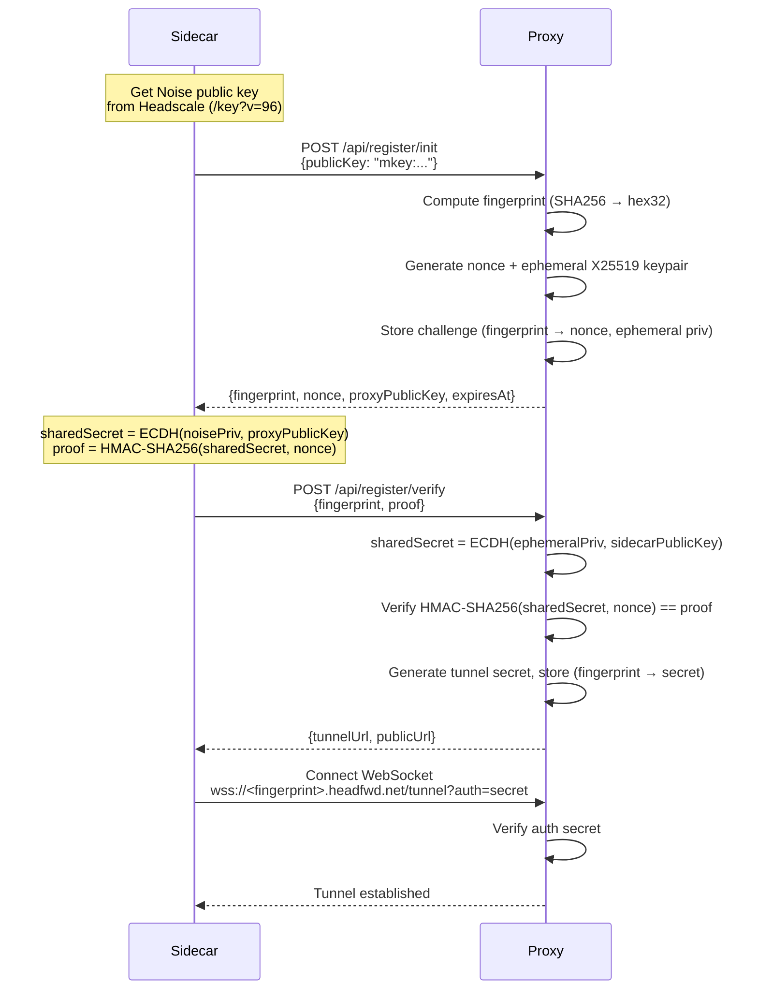

# HeadFwd Registration Architecture

## Overview

HeadFwd uses a two-phase challenge-response authentication protocol to secure registration and prevent unauthorized subdomain enumeration. This ensures only legitimate Headscale instances with valid Noise private keys can register tunnels.

The proof is an **X25519 ECDH + HMAC-SHA256** exchange: the sidecar and proxy derive a shared secret from Headscale's Noise keypair and a proxy-generated ephemeral keypair, then the sidecar HMACs the challenge nonce with it. No new key material (no separate signing key) is introduced — the existing Noise X25519 key is reused. This applies to both the Fly.io (`headfwd-proxy-fly/`) and Cloudflare Workers (`headfwd-proxy/`) backends.

## Security Goals

1. **Proof of Ownership**: Only someone with access to Headscale's Noise private key can complete registration
2. **No Subdomain Enumeration**: Can't guess valid subdomains without the private key
3. **Time-Limited Challenges**: Nonces expire after 5 minutes to prevent replay attacks
4. **Replay Protection**: Each nonce is single-use
5. **Collision Resistance**: 128-bit fingerprints provide ~3.4×10³⁸ unique values

## Registration Flow



## Subdomain Fingerprinting

### Format
- **Encoding**: Hex (32 characters)
- **Bits**: 128 bits of security
- **Source**: First 128 bits of SHA256(Noise public key)
- **Example**: `b4ff5ae7bbf053c9bd58d16df68702e0.headfwd.net`

### Why Hex32?
1. **Universal Support**: Native hex encoding on all platforms (Go, JS, Swift, Kotlin)
2. **No Dependencies**: No external libraries needed
3. **DNS Compatible**: Works in subdomains without issues
4. **Collision Resistant**: ~3.4×10³⁸ possible values (2^128)
5. **Case Insensitive**: Works consistently across systems

### Security Properties
- **Collision Probability**: ~1 in 340 undecillion
- **Brute Force**: Would take billions of years with current computing
- **Enumeration**: Cannot guess valid subdomains without the private key
- **Never Trust the Proxy**: Clients must derive the fingerprint locally and validate any proxy-provided URLs or fingerprints

## Authentication Protocol

### Phase 1: Challenge Initialization

**Request:**
```bash
POST /api/register/init
Content-Type: application/json

{
  "publicKey": "mkey:fedcba9876543210fedcba9876543210fedcba9876543210fedcba9876543210"
}
```

**Response:**
```json
{
  "fingerprint": "b4ff5ae7bbf053c9bd58d16df68702e0",
  "nonce": "a1b2c3d4e5f6789...",
  "proxyPublicKey": "9f86d081884c7d65...",
  "expiresAt": 1738449600000
}
```

**What Happens:**
1. Proxy computes `fingerprint = SHA256(publicKey).substring(0, 32)`
2. Proxy generates a random 32-byte nonce
3. Proxy generates an ephemeral X25519 keypair for this challenge
4. Proxy stores `{publicKey, nonce, ephemeralPrivateKey}` with a 5-minute TTL
5. Returns the challenge (including its ephemeral **public** key) to the sidecar

### Phase 2: Proof Verification

**Request:**
```bash
POST /api/register/verify
Content-Type: application/json

{
  "fingerprint": "b4ff5ae7bbf053c9bd58d16df68702e0",
  "proof": "a1b2c3d4..."
}
```

**Response:**
```json
{
  "fingerprint": "b4ff5ae7bbf053c9bd58d16df68702e0",
  "tunnelUrl": "wss://b4ff5ae7bbf053c9bd58d16df68702e0.headfwd.net/tunnel?auth=SECRET",
  "publicUrl": "https://b4ff5ae7bbf053c9bd58d16df68702e0.headfwd.net"
}
```

**What Happens:**
1. Proxy retrieves the stored challenge for the fingerprint
2. Proxy computes `sharedSecret = X25519(ephemeralPrivateKey, sidecarPublicKey)`
3. Proxy verifies `HMAC-SHA256(sharedSecret, nonce) == proof` (timing-safe compare)
4. If valid:
   - Generate tunnel secret
   - Store `{publicKey, secret}` with a 1-year TTL
   - Delete challenge (single-use)
   - Return tunnel credentials
5. If invalid: Return 403 Forbidden

Because ECDH is symmetric, the sidecar independently derives the same shared secret as `X25519(noisePrivateKey, proxyPublicKey)` — so only the holder of Headscale's Noise private key can produce a matching HMAC.

## Client Verification (Custom Clients)

This section documents an **optional online proof** for custom clients that want to treat the proxy as a dumb forwarder.
It uses the existing Headscale Noise X25519 key and does **not** introduce new key material.

### Step 0: Verify Fingerprint Matches `/key`

1. Client fetches the public key from the Headscale control server:
   - `GET /key?v=96` → `mkey:...`
2. Client computes `fingerprint = SHA256(publicKey).substring(0, 32)`
3. Client verifies the fingerprint matches the subdomain it connected to.

If the fingerprint does **not** match, the client must abort. This detects a proxy misroute or key substitution.

### Step 1 (Planned): Online Attestation Using Noise Key

Add a small endpoint (e.g. `/api/attest`) on the Headscale sidecar to prove possession of the Noise private key.

**Request:**
```json
{
  "clientPublicKey": "<hex X25519 public key>",
  "nonce": "<random 32 bytes, hex>"
}
```

**Server behavior:**
1. Compute `sharedSecret = X25519(noisePrivateKey, clientPublicKey)`
2. Return `proof = HMAC-SHA256(sharedSecret, nonce)`

**Response:**
```json
{
  "proof": "<hex HMAC>"
}
```

**Client verification:**
1. Compute the same `sharedSecret = X25519(clientPrivateKey, serverPublicKey)`
2. Verify `HMAC-SHA256(sharedSecret, nonce)` matches the response

This provides an **interactive proof of key possession** without adding new keys.

## Cryptographic Details

### Key Types
- **Noise Protocol**: Headscale uses Noise_IK pattern with Curve25519/Ed25519
- **Public Key Format**: `mkey:` prefix + 64 hex characters (32 bytes)
- **Private Key**: 64 bytes (32-byte seed + 32-byte public key)

### Proof Scheme
- **Key agreement**: X25519 ECDH between Headscale's Noise key and the proxy's per-challenge ephemeral key
- **Shared secret**: 32 bytes (raw ECDH output)
- **Proof**: `HMAC-SHA256(sharedSecret, nonce)`, encoded as 64 hex characters
- **Verification**: recompute the HMAC proxy-side and compare in constant time
- **No separate signing key**: the existing Noise X25519 keypair is reused; nothing new to manage or leak

### Storage
- **Fly.io backend**: in-memory maps in a single proxy process (challenges + registrations). If the proxy restarts, the sidecar simply re-registers automatically.
- **Cloudflare Workers backend**: `REGISTRY` KV namespace — `challenge:{fingerprint}` (TTL: 5 minutes) and `tunnel:{fingerprint}` (TTL: 1 year).

## Sidecar Implementation

### Command-Line Usage

**Manual Tunnel URL:**
```bash
./headfwd-sidecar \
  --tunnel "wss://b4ff5ae7.headfwd.net/tunnel?auth=SECRET" \
  --headscale "http://localhost:8080"
```

**Auto-Registration:**
```bash
./headfwd-sidecar \
  --register \
  --proxy "https://headfwd.net" \
  --headscale "http://localhost:8080" \
  --noise-key "/var/lib/headscale/noise_private.key"
```

### Docker Compose

```yaml
headfwd-sidecar:
  build: ./headfwd-sidecar
  environment:
    - AUTO_REGISTER=true
    - PROXY_URL=https://headfwd.net
    - HEADSCALE_URL=http://headscale:8080
  volumes:
    - ./headscale/data:/keys:ro
```

### Key Auto-Detection
The sidecar automatically searches for Noise private key in:
1. Path specified by `--noise-key` flag
2. `/var/lib/headscale/noise_private.key`
3. `/keys/noise_private.key` (Docker mount)
4. `./headscale/data/noise_private.key` (local dev)

## Attack Resistance

### Subdomain Enumeration
- **Attack**: Guess valid subdomains by trying random fingerprints
- **Defense**: 
  - 128-bit fingerprints = 2^128 possibilities
  - Without private key, cannot generate valid signatures
  - Challenge-response prevents unauthorized registration

### Replay Attacks
- **Attack**: Reuse captured nonce/signature pairs
- **Defense**:
  - Nonces are single-use (deleted after verification)
  - 5-minute expiration on challenges
  - New signature required for each registration

### Man-in-the-Middle
- **Attack**: Intercept registration traffic
- **Defense**:
  - All production traffic over TLS (wss://, https://)
  - The ECDH+HMAC proof binds registration to the Noise private key
  - Clients additionally verify the Noise key against the fingerprint (see `ios-key-verification.md`)

### Brute Force
- **Attack**: Try to brute force private keys or forge a proof
- **Defense**:
  - X25519 provides ~128-bit security; deriving the shared secret without the Noise private key is infeasible
  - HMAC-SHA256 with a 32-byte secret makes proof forgery infeasible
  - Rate limiting on registration endpoints (TODO)

## Comparison with Alternatives

| Approach | Security | Complexity | Enumeration Risk |
|----------|----------|------------|------------------|
| **Challenge-Response (Current)** | High | Medium | None |
| Shared Secret | Medium | Low | Medium |
| Rate Limiting Only | Low | Low | High |
| OAuth/JWT | High | High | None |

## Future Enhancements

1. **Rate Limiting**: Add rate limits on `/api/register/init` (e.g., 10 req/min per IP)
2. **Key Rotation**: Support for rotating tunnel secrets
3. **Revocation**: API endpoint to revoke tunnel access
4. **Monitoring**: Track registration attempts and failed verifications
5. **Multi-Key**: Support for registering multiple Headscale instances with one account

## References

- [Noise Protocol Framework](http://www.noiseprotocol.org/)
- [X25519 (RFC 7748)](https://datatracker.ietf.org/doc/html/rfc7748)
- [HMAC (RFC 2104)](https://datatracker.ietf.org/doc/html/rfc2104)
- [Cloudflare Workers KV](https://developers.cloudflare.com/kv/)
- [Headscale Documentation](https://headscale.net/)
